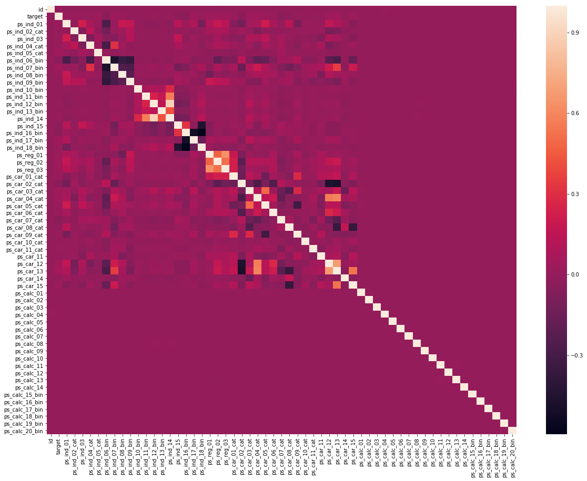
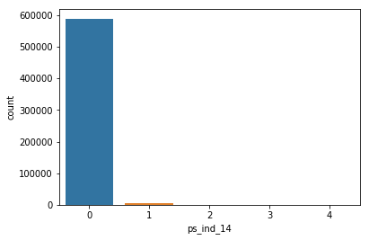
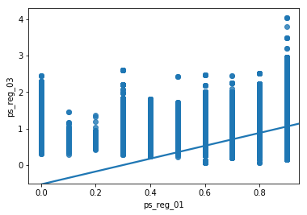
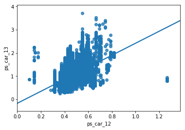
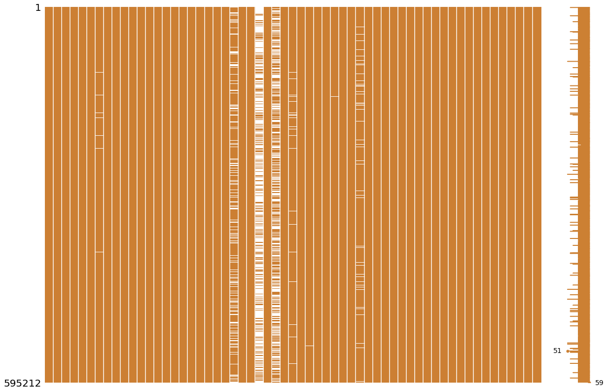

### Analysis and prediction of Porto Seguro’s Safe Driver Prediction data from Kaggle

download data from the competition page. link - https://www.kaggle.com/c/porto-seguro-safe-driver-prediction


```python
import pandas as pd
import numpy as np
%matplotlib inline
```


```python
#read the data
df = pd.read_csv('data/train.csv')
df_test = pd.read_csv('data/test.csv')

```


```python
y = df[['id', 'target']]
x = df.drop('target', axis=1)

```


```python
x.describe()
# x['ps_car_12']
```


<div>
<style>
    .dataframe thead tr:only-child th {
        text-align: right;
    }

    .dataframe thead th {
        text-align: left;
    }

    .dataframe tbody tr th {
        vertical-align: top;
    }
</style>
<table border="1" class="dataframe">
  <thead>
    <tr style="text-align: right;">
      <th></th>
      <th>id</th>
      <th>ps_ind_01</th>
      <th>ps_ind_02_cat</th>
      <th>ps_ind_03</th>
      <th>ps_ind_04_cat</th>
      <th>ps_ind_05_cat</th>
      <th>ps_ind_06_bin</th>
      <th>ps_ind_07_bin</th>
      <th>ps_ind_08_bin</th>
      <th>ps_ind_09_bin</th>
      <th>...</th>
      <th>ps_calc_11</th>
      <th>ps_calc_12</th>
      <th>ps_calc_13</th>
      <th>ps_calc_14</th>
      <th>ps_calc_15_bin</th>
      <th>ps_calc_16_bin</th>
      <th>ps_calc_17_bin</th>
      <th>ps_calc_18_bin</th>
      <th>ps_calc_19_bin</th>
      <th>ps_calc_20_bin</th>
    </tr>
  </thead>
  <tbody>
    <tr>
      <th>count</th>
      <td>5.952120e+05</td>
      <td>595212.000000</td>
      <td>595212.000000</td>
      <td>595212.000000</td>
      <td>595212.000000</td>
      <td>595212.000000</td>
      <td>595212.000000</td>
      <td>595212.000000</td>
      <td>595212.000000</td>
      <td>595212.000000</td>
      <td>...</td>
      <td>595212.000000</td>
      <td>595212.000000</td>
      <td>595212.000000</td>
      <td>595212.000000</td>
      <td>595212.000000</td>
      <td>595212.000000</td>
      <td>595212.000000</td>
      <td>595212.000000</td>
      <td>595212.000000</td>
      <td>595212.000000</td>
    </tr>
    <tr>
      <th>mean</th>
      <td>7.438036e+05</td>
      <td>1.900378</td>
      <td>1.358943</td>
      <td>4.423318</td>
      <td>0.416794</td>
      <td>0.405188</td>
      <td>0.393742</td>
      <td>0.257033</td>
      <td>0.163921</td>
      <td>0.185304</td>
      <td>...</td>
      <td>5.441382</td>
      <td>1.441918</td>
      <td>2.872288</td>
      <td>7.539026</td>
      <td>0.122427</td>
      <td>0.627840</td>
      <td>0.554182</td>
      <td>0.287182</td>
      <td>0.349024</td>
      <td>0.153318</td>
    </tr>
    <tr>
      <th>std</th>
      <td>4.293678e+05</td>
      <td>1.983789</td>
      <td>0.664594</td>
      <td>2.699902</td>
      <td>0.493311</td>
      <td>1.350642</td>
      <td>0.488579</td>
      <td>0.436998</td>
      <td>0.370205</td>
      <td>0.388544</td>
      <td>...</td>
      <td>2.332871</td>
      <td>1.202963</td>
      <td>1.694887</td>
      <td>2.746652</td>
      <td>0.327779</td>
      <td>0.483381</td>
      <td>0.497056</td>
      <td>0.452447</td>
      <td>0.476662</td>
      <td>0.360295</td>
    </tr>
    <tr>
      <th>min</th>
      <td>7.000000e+00</td>
      <td>0.000000</td>
      <td>-1.000000</td>
      <td>0.000000</td>
      <td>-1.000000</td>
      <td>-1.000000</td>
      <td>0.000000</td>
      <td>0.000000</td>
      <td>0.000000</td>
      <td>0.000000</td>
      <td>...</td>
      <td>0.000000</td>
      <td>0.000000</td>
      <td>0.000000</td>
      <td>0.000000</td>
      <td>0.000000</td>
      <td>0.000000</td>
      <td>0.000000</td>
      <td>0.000000</td>
      <td>0.000000</td>
      <td>0.000000</td>
    </tr>
    <tr>
      <th>25%</th>
      <td>3.719915e+05</td>
      <td>0.000000</td>
      <td>1.000000</td>
      <td>2.000000</td>
      <td>0.000000</td>
      <td>0.000000</td>
      <td>0.000000</td>
      <td>0.000000</td>
      <td>0.000000</td>
      <td>0.000000</td>
      <td>...</td>
      <td>4.000000</td>
      <td>1.000000</td>
      <td>2.000000</td>
      <td>6.000000</td>
      <td>0.000000</td>
      <td>0.000000</td>
      <td>0.000000</td>
      <td>0.000000</td>
      <td>0.000000</td>
      <td>0.000000</td>
    </tr>
    <tr>
      <th>50%</th>
      <td>7.435475e+05</td>
      <td>1.000000</td>
      <td>1.000000</td>
      <td>4.000000</td>
      <td>0.000000</td>
      <td>0.000000</td>
      <td>0.000000</td>
      <td>0.000000</td>
      <td>0.000000</td>
      <td>0.000000</td>
      <td>...</td>
      <td>5.000000</td>
      <td>1.000000</td>
      <td>3.000000</td>
      <td>7.000000</td>
      <td>0.000000</td>
      <td>1.000000</td>
      <td>1.000000</td>
      <td>0.000000</td>
      <td>0.000000</td>
      <td>0.000000</td>
    </tr>
    <tr>
      <th>75%</th>
      <td>1.115549e+06</td>
      <td>3.000000</td>
      <td>2.000000</td>
      <td>6.000000</td>
      <td>1.000000</td>
      <td>0.000000</td>
      <td>1.000000</td>
      <td>1.000000</td>
      <td>0.000000</td>
      <td>0.000000</td>
      <td>...</td>
      <td>7.000000</td>
      <td>2.000000</td>
      <td>4.000000</td>
      <td>9.000000</td>
      <td>0.000000</td>
      <td>1.000000</td>
      <td>1.000000</td>
      <td>1.000000</td>
      <td>1.000000</td>
      <td>0.000000</td>
    </tr>
    <tr>
      <th>max</th>
      <td>1.488027e+06</td>
      <td>7.000000</td>
      <td>4.000000</td>
      <td>11.000000</td>
      <td>1.000000</td>
      <td>6.000000</td>
      <td>1.000000</td>
      <td>1.000000</td>
      <td>1.000000</td>
      <td>1.000000</td>
      <td>...</td>
      <td>19.000000</td>
      <td>10.000000</td>
      <td>13.000000</td>
      <td>23.000000</td>
      <td>1.000000</td>
      <td>1.000000</td>
      <td>1.000000</td>
      <td>1.000000</td>
      <td>1.000000</td>
      <td>1.000000</td>
    </tr>
  </tbody>
</table>
<p>8 rows × 58 columns</p>
</div>


### Plot Correlation Matrix
Plot the correaltion between the features and also print the pairs where correlation is greater than 0.6. 


```python

def plot_corr_matrix(df):
    import seaborn as sns
    import matplotlib.pyplot as plt
    plt.subplots(figsize=(20,15))
    # calculate the correlation matrix
    corr = df.corr()

    # plot the heatmap
    sns.heatmap(corr, 
            xticklabels=corr.columns,
            yticklabels=corr.columns)
    
    corr_matrix = df.corr().abs()
    high_corr_var=np.where(corr_matrix>0.6)
    high_corr_var=[(corr_matrix.index[x],corr_matrix.columns[y]) for x,y in zip(*high_corr_var) if x!=y and x<y]
    print(high_corr_var)


plot_corr_matrix(df)
```

    [('ps_ind_12_bin', 'ps_ind_14'), ('ps_reg_01', 'ps_reg_03'), ('ps_car_12', 'ps_car_13')]





### Now exploring the strongly correlated features by visualizing them 

[
('ps_ind_12_bin', 'ps_ind_14'),
('ps_reg_01', 'ps_reg_03'), 
('ps_car_12', 'ps_car_13')]


```python
import seaborn as sns
sns.countplot(x=df['ps_ind_14'], data=df[['ps_ind_12_bin']])
```


    <matplotlib.axes._subplots.AxesSubplot at 0x11a301860>





```python

g = sns.regplot(x=df['ps_reg_01'], y=df['ps_reg_03'])
g.set(ylim=(-0.5, None))
```


    [(-0.5, 4.2907622967638481)]





```python
g = sns.regplot(x=df['ps_car_12'], y=df['ps_car_13'])
g.set(xlim=(0, None))
g.set(ylim=(-0.5, None))
```


    [(-0.5, 4.0615704626906055)]





### Visualize the missing data information


```python
import missingno as msno

train_null = df
train_null = train_null.replace(-1, np.NaN)

msno.matrix(df=train_null.iloc[:, :], figsize=(20, 14), color=(0.8, 0.5, 0.2)) 
```





```python
# Extract columns with null data
train_null = train_null.loc[:, train_null.isnull().any()]

print(train_null.columns)

```

    Index(['ps_ind_02_cat', 'ps_ind_04_cat', 'ps_ind_05_cat', 'ps_reg_03',
           'ps_car_01_cat', 'ps_car_02_cat', 'ps_car_03_cat', 'ps_car_05_cat',
           'ps_car_07_cat', 'ps_car_09_cat', 'ps_car_11', 'ps_car_12',
           'ps_car_14'],
          dtype='object')


```python

```


```python

```
